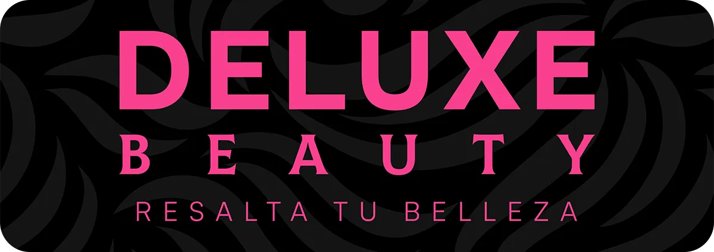

<p align="center">
  
</p>
<p align="center">
	
	
	
	
<p>
<p align="center">
		<em>Desarrollado con el software y las herramientas que se indican a continuación.</em>
</p>
<p align="center">
	
	
	
	
	
	
</p>
<hr>

## 📍 Visión general

Este proyecto es un trabajo freelance que realicé para un cliente. Este necesitaba dar a conocer sus servicios de belleza en general para su nueva empresa por lo que cree un sitio web pensado en sus usuarios objetivos (mayormente mujeres con poco tiempo que prefieren utilizar dispositivos móviles para contratar estos servicios).

---

## 📦 Características

- 🍻 100% Código abierto.
- 📱 Optimizado para dispositivos móviles.
- 👌🏻 Interfaz sencilla e intuitiva.

---

## 🚀 Primeros pasos

**_Requisitos_**

Asegúrete de tener las siguientes dependencias instaladas en su sistema:

- **<code>► Node</code>**: `^20.14.0`
- **<code>► pnpm</code>**: `^9.4.0`

### ⚙️ Instalación

1. Clona el repositorio deluxe-beauty:

```sh
git clone https://github.com/odracirdev/deluxe-beauty
```

2. Cambia al directorio del proyecto:

```sh
cd deluxe-beauty
```

3. Instala las dependencias:

```sh
pnpm install
```

### 🤖 Ejecutar deluxe-beauty

Utiliza el siguiente comando para ejecutar deluxe-beauty:

```sh
pnpm dev
```

---

## 🛠 Roadmap

- [x] `► Maquetación para dispositivos móviles`
- [x] `► Maquetación para dispositivos de es critorio`
- [x] `► Optimización de archivos multimedia`
- [x] `► Optimización del SEO`

---

## 👏 Agradecimientos

- Inspiración para el diseño mobile: [Beauty Clinic Skincare App (Community)](<https://www.figma.com/design/CEamJD6KYaHDoz8HCr6VZL/Beauty-Clinic-Skincare-App-(Community)?node-id=0-1&t=4gV1SgOnFYN2Dife-0>)
- Optimización de Astro: [Félix Icaza](https://github.com/felixicaza)
- Mentoría: [Jaime Alan Gutiérrez Cruz](https://github.com/jagcruz)
- Comunidad de autodidactas [odraciRdev](https://twitch.tv/odracirdev)

[**Return**](#-enlaces-rapidos)

---
